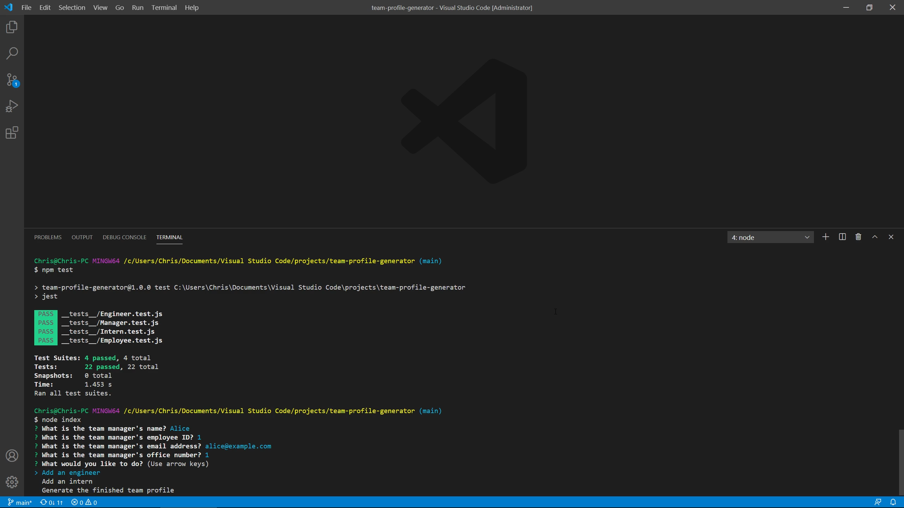

# Team Profile Generator

## Description

Uses command-line input to generate a team profile, including a manager, engineers, and interns, with various useful pieces of information for each.

## Made with
- Node.js
- Inquirer
- Jest
- ES6
- Bootstrap

## Installation

To install necessary dependencies, run the following command:

```
npm i
```

## Usage

Run
```
node index
```
and follow the prompts to generate an index.html file. You can also click the image below to view a demonstration video

[](https://drive.google.com/file/d/1pgtQbC_MNY1XCWiItDSc3mcDfuGjHrbf/view?usp=sharing)


## Testing

Make sure the devDependencies are installed in addition to the production dependencies, then run the following command:
```
npm test
```
